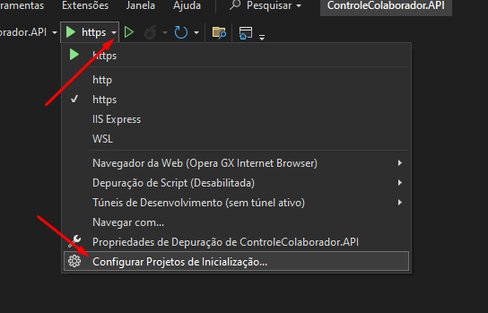
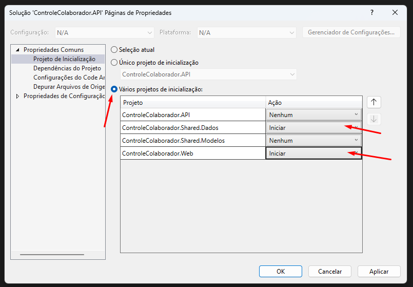

# Controle de Colaboradores

Este é um projeto para gerenciar colaboradores e cargos em uma empresa. Ele inclui um sistema de controle para adicionar, editar, excluir e pesquisar colaboradores, além de associá-los aos seus respectivos cargos.

## Tecnologias Utilizadas

- ASP.NET Core Blazor WebAssembly
- Entity Framework Core
- MudBlazor (para componentes de UI)
- MySQL (banco de dados)

## Estrutura do Projeto

O projeto está dividido em quatro partes:

1. **ControleColaborador.API**: O backend da aplicação, fornecendo os endpoints RESTful para interagir com os dados.
2. **ControleColaborador.Shared.Dados**: Contém o acesso aos dados compartilhados entre o servidor e o cliente.
3. **ControleColaborador.Shared.Modelos**: Contém os modelos de dados compartilhados entre o cliente e o servidor.
4. **ControleColaborador.Web**: O frontend da aplicação, escrito em Blazor WebAssembly, responsável pela interação com o usuário.

## Configuração do Projeto

Certifique-se de ter o SDK do .NET Core instalado na sua máquina.

1. Clone este repositório: `git clone https://github.com/Joaovittorsd/controle-colaboradores.git`
2. Navegue até o diretório do projeto: `cd controle-colaboradores`
3. Instale as dependências: `dotnet restore`
4. Configure o banco de dados MySQL no arquivo `appsettings.json` do projeto `ControleColaborador.Dados`.
5. Execute as migrações do banco de dados: `Update-Database` dentro do diretório `ControleColaborador.Dados`.

## Executando o Projeto

1. Certifique-se de configurar o projeto de inicialização corretamente para que os projetos `ControleColaborador.API` e `ControleColaborador.Web` sejam iniciados simultaneamente. Para fazer isso:
   - Abra a solução no Visual Studio.
   - Clique com o botão direito do mouse na solução no Gerenciador de Soluções.
   - Selecione "Configurar Projetos de inicialização...".
   - Em "Vários Projetos de inicialização",  marque os projetos `ControleColaborador.API` e `ControleColaborador.Web`.
     
   
   

2. Inicie a solução. Isso iniciará tanto o servidor da API quanto o frontend da aplicação Blazor WebAssembly.

3. Abra o navegador e acesse `https://localhost:7166` para visualizar o frontend da aplicação Blazor WebAssembly.

4. Para acessar a API, abra outro navegador ou uma nova aba e acesse `https://localhost:7086`. Aqui você poderá interagir diretamente com a API.

## Funcionalidades Principais

- **Listagem de Colaboradores:** Visualize uma lista de colaboradores existentes.
- **Pesquisa de Colaboradores:** Busque colaboradores pelo nome.
- **Criação de Novo Colaborador:** Adicione novos colaboradores através de uma modal.
- **Edição de Colaborador:** Edite as informações de um colaborador existente através de uma modal.
- **Atualização Automática:** As modais atualizam a página automaticamente ao fechar.
- **Validação de Email:** Validação de email utilizando JavaScript ao sair do campo. Caso o email seja inválido, um aviso é mostrado abaixo do campo.
